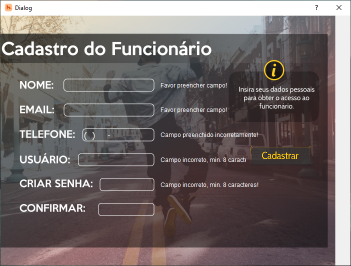
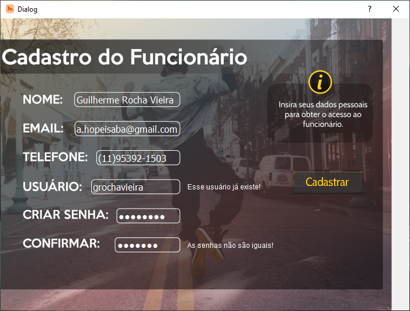
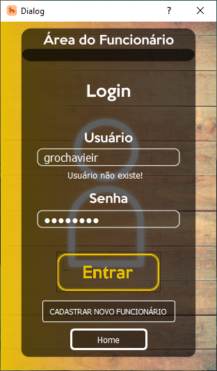
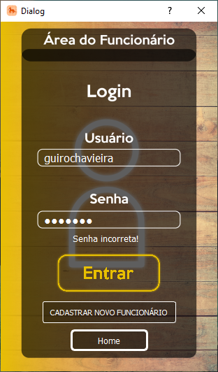

# OBS:
  É necessário importar o build no qt creator para acessar o banco de dados sqlite.
# Desenvolvedores
- Guilherme Rocha RA: 22.118.024-3
- Thomas Anderson RA: 22.118.175-3
- Victor Masumoto RA: 22.118.003-0

# Controle e Gerenciamento de Estoque
 
  Esse software foi desenvolvido com o intuito de gerenciar o estoque de produtos de uma empresa genérica, e, além disso, para simular a compra e venda de produtos foi criada uma seção para os clientes utilizarem, para que exista essa dinâmica entre a empresa e o cliente, e para que os produtos do estoque possam ser modificados em uma situação mais realista.

## Tela Inicial

  A tela inicial é onde você pode escolher entre ser um funcionário ou um cliente, na qual o funcionário será responsável pelo gerenciamento do estoque da empresa, enquanto que o cliente será capaz de realizar compras e pedidos para essa mesma empresa.
  

  

##  Tela de Login do Funcionário
  
  Na tela de login do funcionário, ele pode escolher entre voltar para a tela inicial com o botão <b>home</b>, se cadastrar com o botão <b>cadastrar novo funcionário</b> ou caso ele já esteja cadastrado, inserir suas informações e acessar a tela de gerenciamento do estoque ao apertar o botão <b> Entrar</b>.

  

## Tela de Cadastro de Funcionário

  Aqui é onde o funcionário realizará seu cadastro para fazer login no sistema, no entanto, é necessário que ele realize o preenchimento de cada campo de forma correta, sem deixar campos em branco, ou insuficientes, como podemos ver nas imagens a seguir:

  
  

  Na primeira imagem, se o funcionário pressionar o botão de cadastrar, aparecerá todos os erros relacionado aos campos que ele precisa preencher. Já na segunda imagem, após preencher os campos, existem dois casos especiais relacionados ao login e a senha, no caso do login, não pode existir mais de um login com o mesmo nome, enquanto que no caso da senha, ela precisa ter pelo menos 8 characteres e, obviamente, ambos os campos da senha e confirmar senha devem ser iguais.

### Processo de Login

  Quando o funcionário já está cadastro e for realizar o login no sistema, essa tela também é responsável por verificar duas variaveis, primeiro o nome de usuário, que como podemos ver na imagem abaixo, apresenta um erro caso o funcionário digite um nome de login que não foi cadastrado:

  

  E caso o usuário exista, porém a senha está errada, ele apresenta uma mensagem de erro:

  

## Tela de Gerenciamento de Estoque
