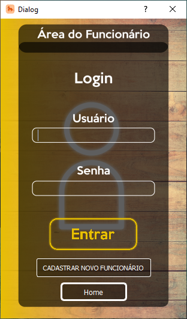

# OBS:
  É necessário importar o build no qt creator para acessar o banco de dados sqlite.
# Desenvolvedores
- Guilherme Rocha RA: 22.118.024-3
- Thomas Anderson RA: 22.118.175-3
- Victor Masumoto RA: 22.118.003-0

# Controle e Gerenciamento de Estoque
 
  Esse software foi desenvolvido com o intuito de gerenciar o estoque de produtos de uma empresa genérica, e, além disso, para simular a compra e venda de produtos foi criada uma seção para os clientes utilizarem, para que exista essa dinâmica entre a empresa e o cliente, e para que os produtos do estoque possam ser modificados em uma situação mais realista.

## Tela Inicial

  A tela inicial é onde você pode escolher entre ser um funcionário ou um cliente, na qual o funcionário será responsável pelo gerenciamento do estoque da empresa, enquanto que o cliente será capaz de realizar compras e pedidos para essa mesma empresa.
  

  

##  Tela de Login do Funcionário
  
  Na tela de login do funcionário, ele pode escolher entre voltar para a tela inicial com o botão <b>home</b>, se cadastrar com o botão <b>cadastrar novo funcionário</b> ou caso ele já esteja cadastrado, inserir suas informações e acessar a tela de gerenciamento do estoque ao apertar o botão <b> Entrar</b>.

  

