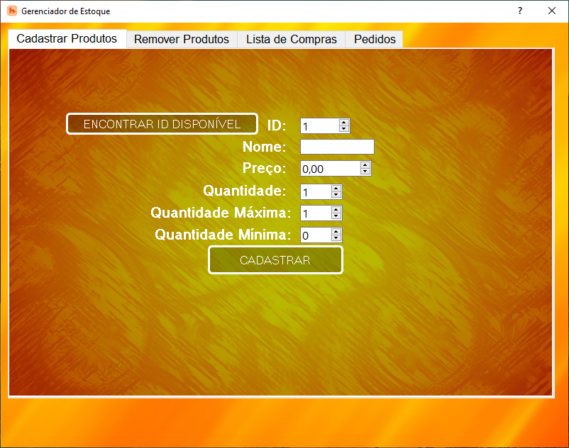

# OBS:
  É necessário importar o build no qt creator para acessar o banco de dados sqlite.
# Desenvolvedores
- Guilherme Rocha RA: 22.118.024-3
- Thomas Anderson RA: 22.118.175-3
- Victor Masumoto RA: 22.118.003-0

# Controle e Gerenciamento de Estoque
 
  Esse software foi desenvolvido com o intuito de gerenciar o estoque de produtos de uma empresa genérica, e, além disso, para simular a compra e venda de produtos foi criada uma seção para os clientes utilizarem, para que exista essa dinâmica entre a empresa e o cliente, e para que os produtos do estoque possam ser modificados em uma situação mais realista.

## Tela Inicial

  A tela inicial é onde você pode escolher entre ser um funcionário ou um cliente, na qual o funcionário será responsável pelo gerenciamento do estoque da empresa, enquanto que o cliente será capaz de realizar compras e pedidos para essa mesma empresa.
  

  

##  Tela de Login do Funcionário
  
  Na tela de login do funcionário, ele pode escolher entre voltar para a tela inicial com o botão <b>home</b>, se cadastrar com o botão <b>cadastrar novo funcionário</b> ou caso ele já esteja cadastrado, inserir suas informações e acessar a tela de gerenciamento do estoque ao apertar o botão <b> Entrar</b>.

  

## Tela de Cadastro de Funcionário

  Aqui é onde o funcionário realizará seu cadastro para fazer login no sistema, no entanto, é necessário que ele realize o preenchimento de cada campo de forma correta, sem deixar campos em branco, ou insuficientes, como podemos ver nas imagens a seguir:

  
  

  Na primeira imagem, se o funcionário pressionar o botão de cadastrar, aparecerá todos os erros relacionado aos campos que ele precisa preencher. Já na segunda imagem, após preencher os campos, existem dois casos especiais relacionados ao login e a senha, no caso do login, não pode existir mais de um login com o mesmo nome, enquanto que no caso da senha, ela precisa ter pelo menos 8 characteres e, obviamente, ambos os campos da senha e confirmar senha devem ser iguais.

### Processo de Login do Funcionário

  Quando o funcionário já está cadastro e for realizar o login no sistema, essa tela também é responsável por verificar duas variaveis, primeiro o nome de usuário, que como podemos ver na imagem abaixo, apresenta um erro caso o funcionário digite um nome de login que não foi cadastrado:

  

  E caso o usuário exista, porém a senha está errada, ele apresenta uma mensagem de erro:

  

## Tela de Gerenciamento de Estoque

  Como é possível ver na imagem abaixo, a tela de cadastro está dividida em 4 abas: Cadastrar Produtos, Remover Produtos, Lista de Compras e Pedidos, cada qual com sua função específica que será explicada adiante. 

  

### Aba Cadastrar Produtos
  
  Nessa aba é realizado o cadastro dos produtos do estoque, na qual é necessário preencher os campos mostrados na imagem e, caso contrário, é mostrado uma mensagem de erro. No caso dos campos que se referem a quantidade, o software automáticamente impede que a quantidade máxima seja maior que a quantidade atual, assim como impede que a quantidade mínima seja maior que a quantidade atual.

  

  Como é possível editar o id do produto, normalmente isso poderia erros como o que foi expressado na imagem abaixo:

  

  No entanto, foi adicionado um botão para buscar pelo primeiro ID disponível para cadastrar um produto, assim o funcionário pode utilizar o padrão de ID que quiser, mas caso esqueça em algum momento, ele pode utilizar o botão para buscar o primeiro ID desocupado.
  

  

### Aba Remover Produtos

  Nessa aba é onde pode ser realizado o processo de listagem dos produtos, assim como a exclusão dos mesmos.

  

  Para pesquisar por um produto, basta digitar seu nome no campo <b>Pesquisar Produto</b> e pressionar o botão <b>Pesquisar</b>.

  

  Para listar todos os produtos, basta pressionar o botão <b>Listar todos os produtos</b>.

  

E para excluir um produto, é só selecionar ele clicando em cima, e então apertar o botão <b>Excluir</b>, como mostra a imagem abaixo:

  

E assim, o produto é excluído do banco de dados e, consequentemente, da listagem.

  

### Aba Lista de Compras

  Essa aba é responsável por mostrar a lista de produtos em ordem de prioridade de compra, logo, ele mostra quais são os itens que precisam ser repostos no estoque, fazendo uma relação entre a quantidade atual e a quantidade mínima que foi estabelecidade no seu cadastro, e que eventualmente é atualizada quando um cliente faz um pedido.

  

  Essa lista então é enviada com os itens que precisam ser repostos ao pressionar o botão <b>Repor Estoque</b>, para que então sejá realizado o processo de reposição dos itens (que será detalhado na seção sobre o processo de compra e reposição).

### Aba Pedidos

  Aqui é realizado uma listagem em ordem de prioridade de todos pedidos feitos pelos clientes, na qual a ordem de prioridade é relacionada a ordem que os pedidos foram realizados.

  

## Tela de Login do Cliente

  Essa tela é utilizada para o cliente realizar seu login e acessar a interface que simula as compras de produtos da empresa, na qual existe a opção dele realizar um cadastro, caso ele não tenha, ao pressionar o texto <b>Sem cadastro? Clique Aqui!</b>, ou então acessar o sistema após preencher corretamente os campos com seus dados e pressionar o botão <b>Entra</b>.

  

## Tela de Cadastro do Cliente

### Processo de Login do Cliente
